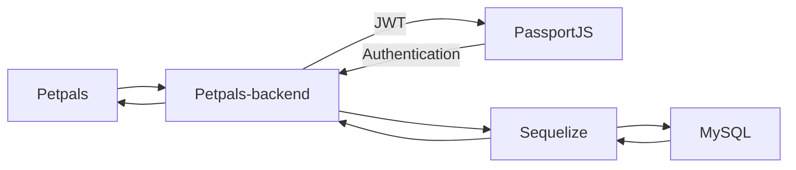

# Petpals

## 📘 Description

A Group Final-Project in CodeCamp 4 (2019).

## 📦 Built With

- [Ant Design](https://ant.design/) - A CSS Framework
- [Create React App](https://github.com/facebook/create-react-app) - A Project Creator
- [React](https://reactjs.org/) - A Frontend Framework
- [Redux](https://redux.js.org/) - A Predictable state Container for JavaScript apps

## 🛠 Structure




## 📋 Features

- Marketplace

## 🏷 Version

- Current Version: 0.1.0
- For the versions available, see the [tags on this repository.](https://github.com/Petpals-CC4/petpals-frontend/tags)

## 💡 Getting Started

1️⃣ Clone this project by

  ```bash
    git clone https://github.com/Petpals-CC4/petpals-frontend.git
  ```

2️⃣ Run Commands

  ```bash
    npm install # or just `yarn`

    npm start # or just `yarn start`

    # Default link: http://localhost:3000/
  ```

3️⃣ Enjoy with :D

## 📚 Acknowledgements

You can learn more in the [Create React App documentation](https://facebook.github.io/create-react-app/docs/getting-started).

To learn React, check out the [React documentation](https://reactjs.org/).

## 😎 Author

Petpals Team - Codecamp 4 (2019)

## 🚩 Created at

13 Jan 2020
